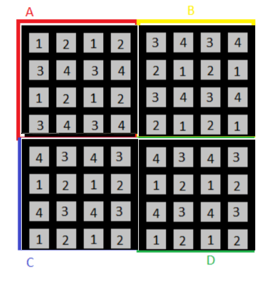
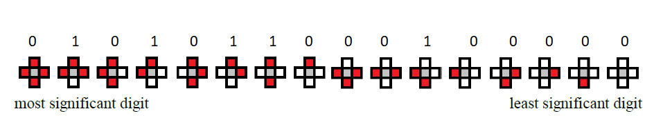
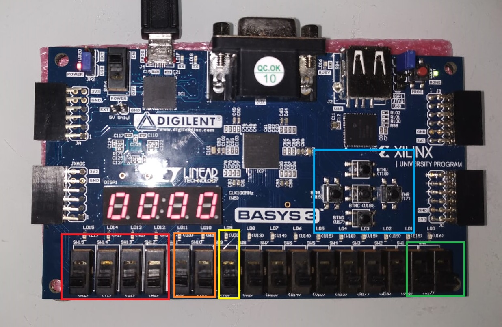

# What is this?

This is a project where I have built a cellular automata to Basys3 FPGA. A [cellular automata](https://en.wikipedia.org/wiki/Cellular_automaton) is basically a model consisted of cells that are neighbour to each other. When executed, each step of the cellular automata is determined by a set of rules with respect to these cells being on or off. [Conway's game of life](https://en.wikipedia.org/wiki/Conway%27s_Game_of_Life) is one of the most known examples of a cellular automata.  

This was an assignment from a computer science course called Digital Design. What this program is supposed to do is described in the file CS223Project_v3.pdf, the cellgroups and rules that are determined by my ID number can be seen in the files myCellGroups.png and myRules.png, furthermore, the block diagrams, high level state machine structure and block explanations that I have used making this program are presented in the file CS223 Project Report.pdf

myCellGroups.png

myRules.png

# How to run it?

To physically run this, you need the fpga Basys3, and Vivado's program to program it. First open the project.xpr file, then connect your Basys3 into computer. Open the hardware manager and click open the target -> auto-connect. Then right click xc7a35t_0 and select "program it", now you must be able to physically run our cellular automata through the FPGA.

# Demonstration

We can only use the selected buttons/switches in the above image for interacting with the program. 

* The switches that are in the red area for chosing a hexadecimal number, 
* The switches that are in the orange area are for chosing the digit which we want to write (for example if we turn on the first switch and turn off the second one, we will be changing the third digit from the right side), 
* The switch in the yellow area is for enabling the changing the stored values in the related registers. 
* The switches in the green area for selecting the which quarter of the cells are we dealing with.

In essence, by using those 9 switches, we can assign and change the states of the cells in a 8x8 grid. 

And finally, the buttons in the blue area are for executing the automata. So basically the button on the left is for updating the cells of type 1,  the button on the up is for updating the cells of type 2, the button on the up is for updating the cells of type 3, the button on the up is for updating the cells of type 4. And the button in the middle is for resetting the game. 
